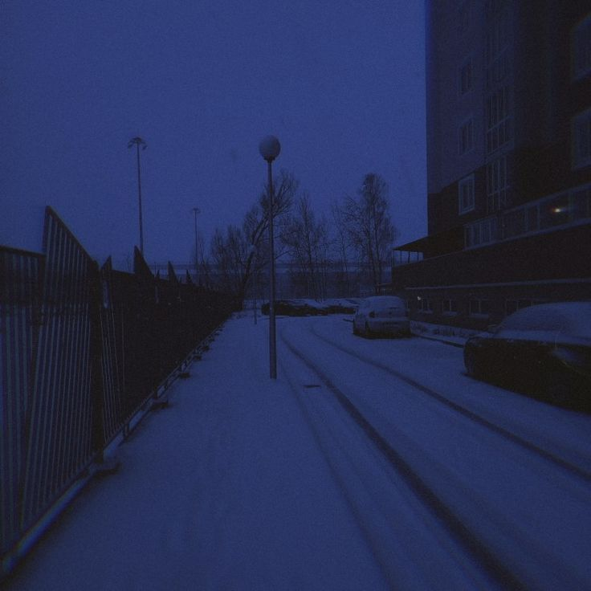
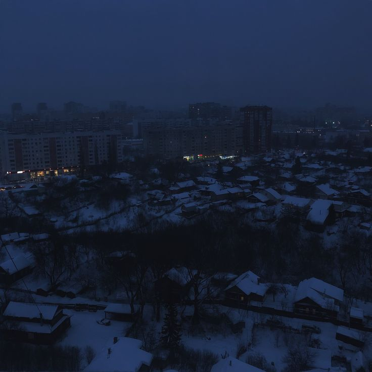
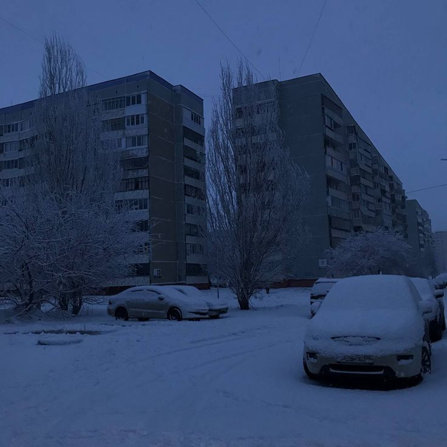
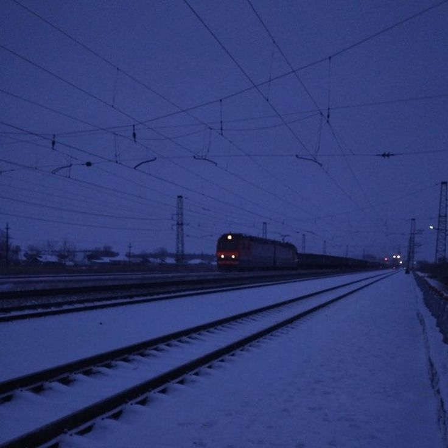
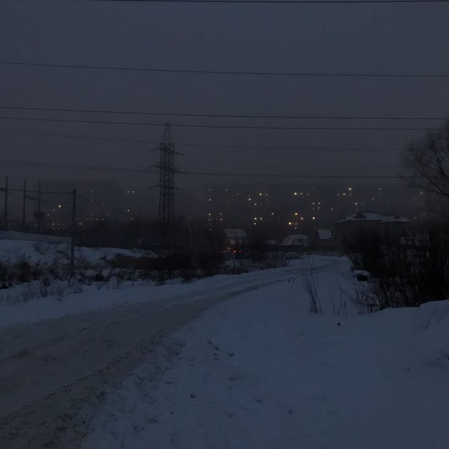
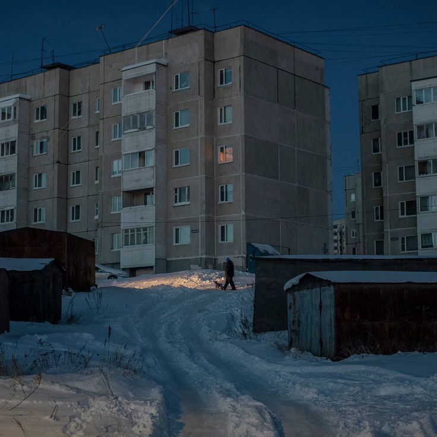

# 6-html-css-responsive-design 
## Адаптивный дизайн


Медиа-запросы (`@media queries`) в CSS позволяют применять разные стили в зависимости от характеристик устройства, например, ширины экрана, его ориентации, разрешения и других параметров. <br><br>
Это основной инструмент для создания адаптивного дизайна, который хорошо выглядит на разных устройствах (десктопах, планшетах, телефонах и т.д.).

Синтаксис медиазапроса выглядит так:

```css
@media (условие) {
    /* Стили, которые применяются только при выполнении этого условия */
}
```
## Примеры медиазапросов

**1.** Медиазапрос для планшетов и телефонов (ширина экрана до 768px):

```css
@media (max-width: 768px) {
    /* Стили, которые будут применяться при ширине экрана 768px и меньше */
}
```
**2.** Медиазапрос для телефонов (ширина экрана до 480px):

```css
@media (max-width: 480px) {
    /* Стили для экранов 480px и меньше */
}
```

**3.** Медиазапрос для экранов с минимальной шириной (например, для больших экранов):

```css
@media (min-width: 1024px) {
    /* Стили для экранов шириной 1024px и больше */
}
```

**4.** Медиазапросы для ориентации экрана (портретной или ландшафтной):

```css
@media (orientation: portrait) {
    /* Стили для устройств в портретной ориентации */
}

@media (orientation: landscape) {
    /* Стили для устройств в ландшафтной ориентации */
}
```

**5.** Комбинированные медиазапросы. Медиазапросы можно комбинировать, чтобы уточнить условия для применения стилей. Например, для планшетов в ландшафтной ориентации:

```css
@media (max-width: 768px) and (orientation: landscape) {
    /* Стили для планшетов в ландшафтной ориентации */
}
```

## Адаптивная страница
### HTML

Пример HTML-страницы предназначеной для отображения набора фотографий в адаптивном формате с использованием HTML, CSS и медиазапросов.

```html
<!DOCTYPE html>
<html lang="en">
<head>
    <meta charset="UTF-8">
    <meta name="viewport" content="width=device-width, initial-scale=1.0">
    <title>archive.rar</title>
    <link rel="icon" href="./images/icon.png">
</head>
<body>
    <div id="text">
        <h2>archive.rar</h2>
        <p>Just a collection of photos</p>
    </div>
    <div id="images-box">
        
        
        
        
        
        
    </div>
</body>
</html>
```
* Страница имеет основную структуру с контейнером `#images-box`, который содержит несколько изображений.
* Каждое изображение (``) загружается из локальной папки /images и отображается с классом `images`, чтобы применять к нему стили из CSS.
* Контейнер с заголовком и изображениями организован в HTML так, чтобы поддерживать гибкое отображение и легко адаптироваться под разные устройства.


### CSS

```css
body {
    margin: 0;
    padding: 0;
    background-color: black;
}

#text {
    width: 80%;
    margin: 0 auto;

    color: white;
    font-family: 'Courier New', Courier, monospace;
}

#images-box {
    width: 80%;
    margin: 0 auto;

    padding: 15px; /* Отступы по бокам и сверху/снизу */

    color: white;
    font-family: 'Courier New', Courier, monospace;
    
    display: grid;
    gap: 15px; /* Расстояние между изображениями */
    grid-template-columns: repeat(3, 1fr); /* Три колонки для больших экранов */
}

.images {
    width: 100%; /* Заполняет всю ячейку */
}
```
* Базовые стили. Фон страницы установлен на черный, а шрифт — моноширинный для создания стилизованного вида. Контейнер для изображений имеет ограниченную ширину и центрируется на экране.
* Grid. Используется CSS Grid для создания сетки, которая адаптируется к разным размерам экрана, позволяя управлять количеством колонок.


### CSS Media

Теперь добавим медиазапросы. Медиазапросы применяются для изменения количества изображений в строке в зависимости от ширины экрана. 
```css
/* media */
/* Адаптация для планшетов */
@media (max-width: 768px) {
    #images-box {
        grid-template-columns: repeat(2, 1fr); /* Две колонки */
    }
}

/* Адаптация для телефонов */
@media (max-width: 480px) {
    #images-box {
        grid-template-columns: 1fr; /* Одна колонка */
    }
}
```
На больших экранах показываются 3 изображения в ряд, на планшетах — 2, а на телефонах — 1 изображение.

Версия под планшеты:


Версия под мобильные устройства:


Можно добавить ещё корректировок и сделать изображения меньше/больше в зависимости от размера устройства. Менять абсолютно любые свойства: расположение, размер, цвет и т.д. Так можно делать с любыми объектами.
